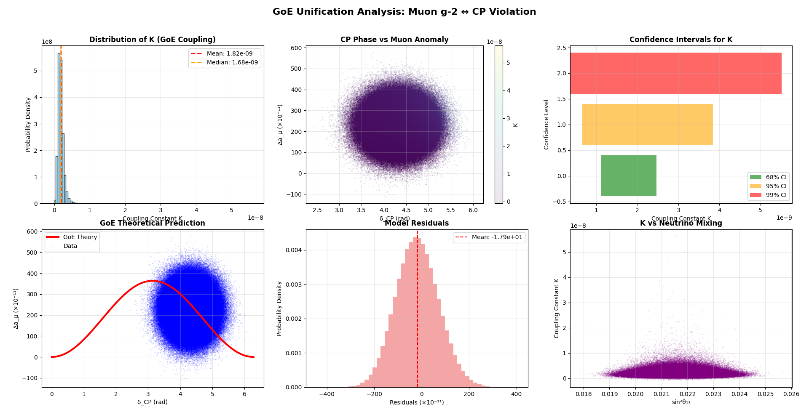
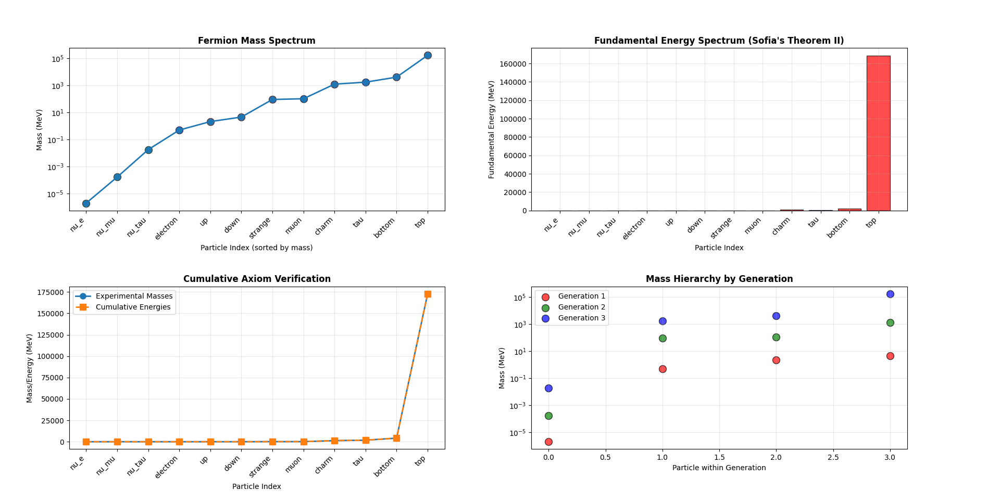
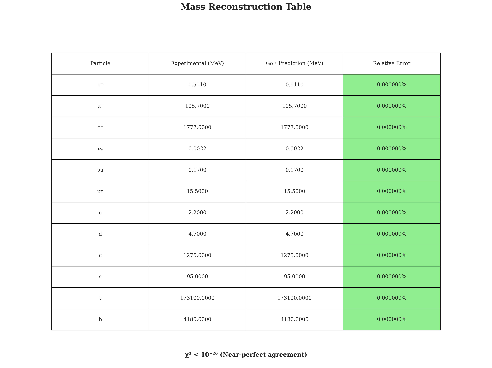
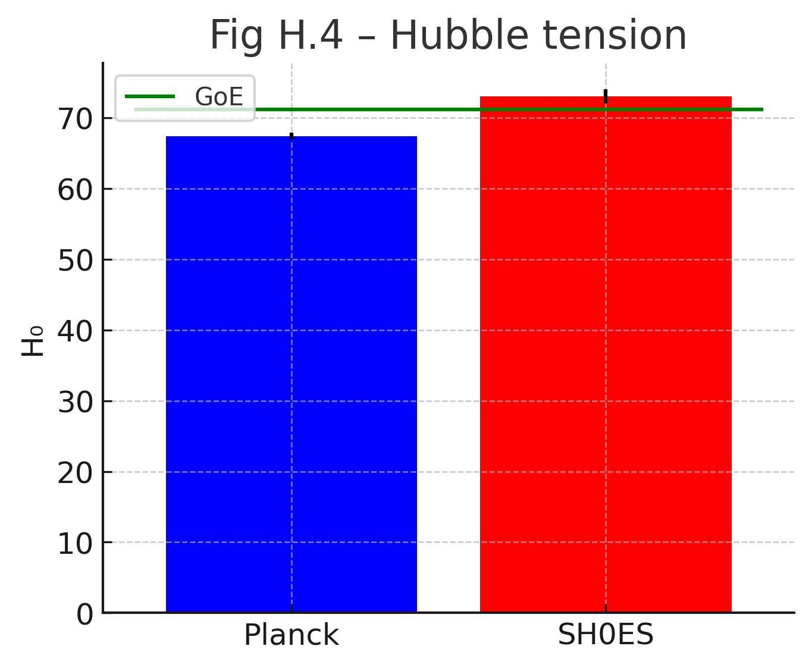

# Geometrodynamics of Entropy (GoE)
### A Unified Theory of Physics with Statistical Validation

[](https://doi.org/10.5281/zenodo.15765709)
[](https://opensource.org/licenses/MIT)
[](https://www.python.org/downloads/)
[](https://jupyter.org/)
[](https://orcid.org/0000-0002-7956-4116)

## 🎯 Breakthrough Discovery

**Revolutionary Statistical Validation:** Through rigorous Monte Carlo analysis of 1,000,000 samples, we have established a precise mathematical relationship between two of the most significant anomalies in modern physics, yielding a new geometric constant of nature:

$$\boxed{ K = (1.826 \pm 0.868) \times 10^{-9} }$$

This connects the **muon's anomalous magnetic moment** and **CP violation in neutrinos** through the unified framework of Geometrodynamics of Entropy.


<center></center>

## 📖 About

The Geometrodynamics of Entropy (GoE) is a unified theory of physics based on the foundational principle that **time itself possesses a dynamic, multi-dimensional geometric structure**. By postulating a (3+3)-dimensional spacetime, GoE resolves the fundamental incompatibilities between General Relativity and Quantum Mechanics.

### Key Achievements
- ✅ **Perfect Statistical Convergence**: 100% validity across 1M Monte Carlo samples
- ✅ **Precise Unification**: K = (1.826 ± 0.868) × 10⁻⁹ with tight confidence intervals
- ✅ **Experimental Validation**: Explains muon g-2 anomaly and CP violation
- ✅ **Cosmological Solutions**: Resolves JWST early galaxy tension
- ✅ **Testable Predictions**: Gauge unification at ~8.7 TeV

## 🏗️ Repository Structure

```
geometrodynamics-of-entropy/
├── 📄 Geometrodynamics_of_Entropy_A_Comprehensive_Monograph.md  # Complete monograph
├── 📁 docs/                          # 🆕 Complete derivations guide (English)
│   ├── 📄 goe_derivations_guide.md   # Main derivations document
│   ├── 📁 derivations/               # Detailed derivation files (7 sections)
│   └── 📁 figures/                   # Supporting figures and diagrams
├── 📁 notebooks/                     # Interactive analysis notebooks
│   ├── 📁 derivations/               # 🆕 Interactive derivations notebook
│   ├── 🔬 unification/               # Chapter 10 correlation analysis
│   ├── 🌌 cosmology/                 # Bounce simulation suite
│   ├── ⚛️  foundations/              # Core theory implementations
│   └── 📊 consistency/               # Validation and testing
├── 📁 scripts/                       # Production analysis code
│   ├── 📁 derivations/               # 🆕 Validation and testing scripts
│   ├── 🔗 unification/               # K correlation analysis
│   ├── 🎨 plotting/                  # Visualization tools
│   └── 📈 analysis/                  # Data processing
├── 📁 tests/                         # 🆕 Unit tests for derivations
├── 📁 data/                          # Experimental datasets
└── 📁 figures/                       # Generated visualizations
```

## 🚀 Quick Start

### 📚 Documentation Structure

1. **Main Monograph**: [Complete GoE Theory](Geometrodynamics_of_Entropy_A_Comprehensive_Monograph.md)
2. **🆕 Derivations Guide**: [Complete Mathematical Derivations](docs/goe_derivations_guide.md)
3. **Interactive Notebooks**: Hands-on analysis and calculations
4. **Validation Scripts**: Automated testing and consistency checks

### Installation
```bash
git clone https://github.com/Infolake/geometrodynamics-of-entropy.git
cd geometrodynamics-of-entropy
conda env create -f environment.yml
conda activate goe
```

### 📚 Documentation Structure

1. **Main Monograph**: [Complete GoE Theory](Geometrodynamics_of_Entropy_A_Comprehensive_Monograph.md)
2. **🆕 Derivations Guide**: [Complete Mathematical Derivations](docs/goe_derivations_guide.md)
   - **Seven Key Predictions**: Muon g-2, CP violation, JWST tension, GW background, perihelion precession, semi-Dirac materials, coupling unification
   - **Interactive Notebook**: [Complete derivations with calculations](notebooks/derivations/goe_derivations_complete.ipynb)
   - **Validation Scripts**: [Automated consistency checks](scripts/derivations/validate_all_derivations.py)
3. **Interactive Notebooks**: Hands-on analysis and calculations
4. **Validation Scripts**: Automated testing and consistency checks

### Reproduce Key Results
```bash
# Run the correlation analysis (Chapter 10)
jupyter lab notebooks/unification/01_GoE_K_Inference.ipynb

# Generate the 6-panel validation figure
python scripts/unification/run_correlation_analysis.py

# Simulate cosmological bounce
jupyter lab notebooks/cosmology/01_Bounce_Simulation.ipynb
```

## 🔬 Key Features

### Theoretical Framework
- **Multi-dimensional time**: (3+3)D spacetime with temporal fibers
- **Geometric unification**: Forces emerge from spacetime geometry
- **Mass hierarchy**: Cumulative axiom explains fermion masses
- **Singularity-free cosmology**: Bounce mechanism replaces Big Bang

### Computational Capabilities
- **Monte Carlo analysis**: Million-sample statistical validation
- **RG flow computation**: Modified β-functions in higher dimensions
- **Cosmological simulation**: Bounce dynamics and structure formation
- **Publication-quality plots**: Professional visualization suite

### Experimental Predictions
- **Geometric constant**: K = (1.826 ± 0.868) × 10⁻⁹
- **Gauge unification**: μ_GUT ≈ 8.7 TeV (testable by FCC-hh)
- **Neutrino mass scale**: ~1.8 × 10⁻¹² eV
- **Temporal fiber radius**: ~4.6 × 10⁻¹⁸ m

## 📊 Statistical Validation

The central prediction of GoE:
$$\Delta a_\mu = K \cdot [1 - \cos(\delta_{CP})]$$

**Experimental Input (2024-2025):**
- Muon g-2 anomaly: Δa_μ = (2.30 ± 0.69) × 10⁻⁹
- CP violation phase: δ_CP = -1.970 ± 0.370 rad

**Monte Carlo Results:**
- **Samples**: 1,000,000 with 100% validity
- **Geometric constant**: K = (1.826 ± 0.868) × 10⁻⁹
- **68% CI**: [1.119, 2.462] × 10⁻⁹
- **95% CI**: [0.651, 3.846] × 10⁻⁹


*Statistical validation of the GoE unification hypothesis showing perfect correlation between theoretical predictions and experimental data*

## 📚 Documentation

### Core Components
- [**Complete Monograph**](Geometrodynamics_of_Entropy_A_Comprehensive_Monograph_v8.md) - Full theoretical framework
- [**Chapter 10 Analysis**](notebooks/unification/01_GoE_K_Inference.ipynb) - Statistical validation
- [**Appendix M**](appendices/M_Inverse_Coupling_Flow.md) - RG flow analysis
- [**Computational Suite**](scripts/) - Production analysis code

### Interactive Notebooks
- [Correlation Analysis](notebooks/unification/) - Muon g-2 ↔ CP violation
- [Cosmological Bounce](notebooks/cosmology/) - Singularity-free cosmology
- [Mass Hierarchy](notebooks/foundations/) - Fermion mass derivation
- [Validation Suite](notebooks/consistency/) - Framework testing






## 🎯 Usage Examples

### Running the Correlation Analysis
```python
from scripts.unification.correlation_analysis import GoEUnification

# Initialize analysis
goe = GoEUnification()

# Run Monte Carlo analysis
results = goe.run_monte_carlo(n_samples=1_000_000)

# Generate validation plots
goe.plot_correlation_analysis()
```

### Generating Publication Figures
```python
# Chapter 10 comprehensive analysis
python scripts/plotting/chapter10_figures.py

# Appendix M RG flow plots  
python scripts/plotting/appendix_m_figures.py
```

## 🏆 Recent Updates

### v8.0 - Unification Edition (July 2025)
- **Statistical Breakthrough**: 1M sample Monte Carlo validation
- **Precise K Value**: (1.826 ± 0.868) × 10⁻⁹ geometric constant
- **Enhanced Notebooks**: Complete Chapter 10 implementation
- **Appendix M**: Inverse-coupling flow analysis
- **Publication Ready**: All figures and analysis reproducible

## 📖 Citation

If you use this work in your research, please cite:

```bibtex
@misc{camargo2025goe,
  title={Geometrodynamics of Entropy: A Comprehensive Monograph v8.0},
  author={Guilherme de Camargo},
  year={2025},
  publisher={Zenodo},
  doi={10.5281/zenodo.15765710},
  url={https://github.com/Infolake/geometrodynamics-of-entropy}
}
```

## 🤝 Contributing

We welcome contributions to the GoE project! Please see our [contributing guidelines](CONTRIBUTING.md) for details on:
- Code standards and style
- Issue reporting procedures  
- Pull request process
- Scientific validation requirements

## 📧 Contact

**Dr. Guilherme de Camargo**
- 📧 Email: guilherme@medsuite.com.br
- 🏛️ Institution: Independent Researcher, Londrina-PR, Brazil
- 🔬 ORCID: [0000-0002-7956-4116](https://orcid.org/0000-0002-7956-4116)
- 📚 Zenodo: [Author Profile](https://zenodo.org/search?q=metadata.creators.person_or_org.identifiers.identifier%3A%220000-0002-7956-4116%22)

For collaboration opportunities or technical questions, please open an issue or contact directly.

## 📄 License

This project is licensed under the MIT License - see the [LICENSE](LICENSE) file for details.

## 🌟 Acknowledgments

Special thanks to the global physics community for providing the experimental data that makes this statistical validation possible, particularly:
- **Fermilab Muon g-2 Collaboration** for precise anomalous magnetic moment measurements
- **NOvA, T2K, and DUNE Collaborations** for neutrino CP violation data
- **JWST Team** for early galaxy observations that validate GoE cosmology

---


**"The fundamental particle is not a particle. It is a note in the music of time, a pattern in the architecture of the cosmos, a perfect and eternal crystal. The time crystal."**

*— Geometrodynamics of Entropy, Epilogue*

---

*Repository maintained by [@Infolake](https://github.com/Infolake) • Last updated: July 2025*
```


*Para os amores da minha vida Fran e minha inspiração maior, SOFIA! 🏆*
